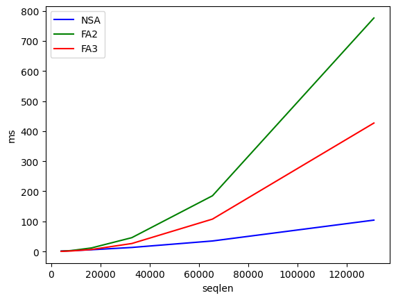
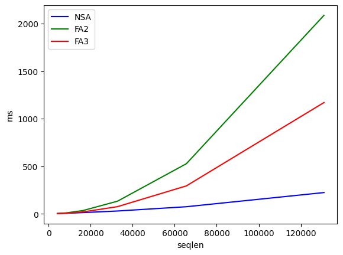
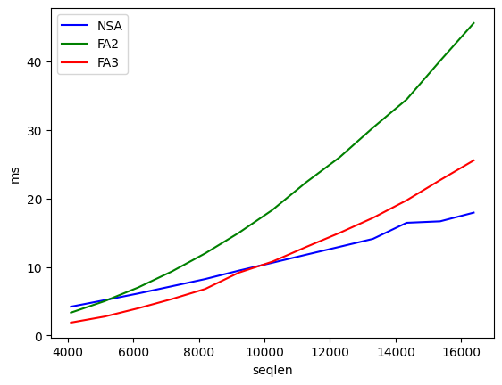
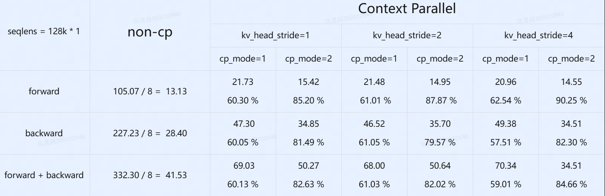
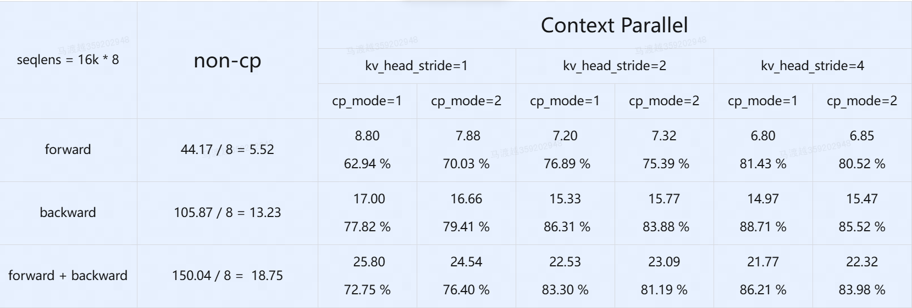
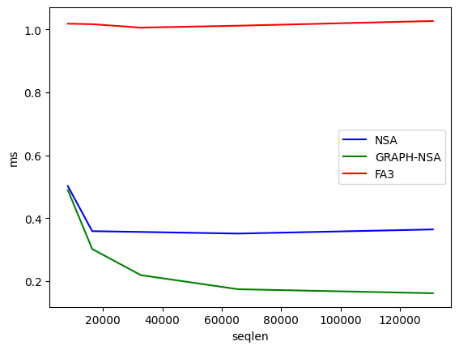
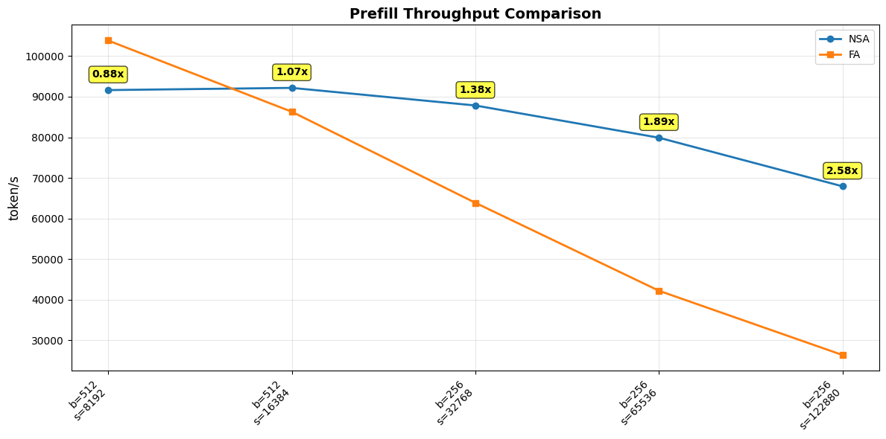
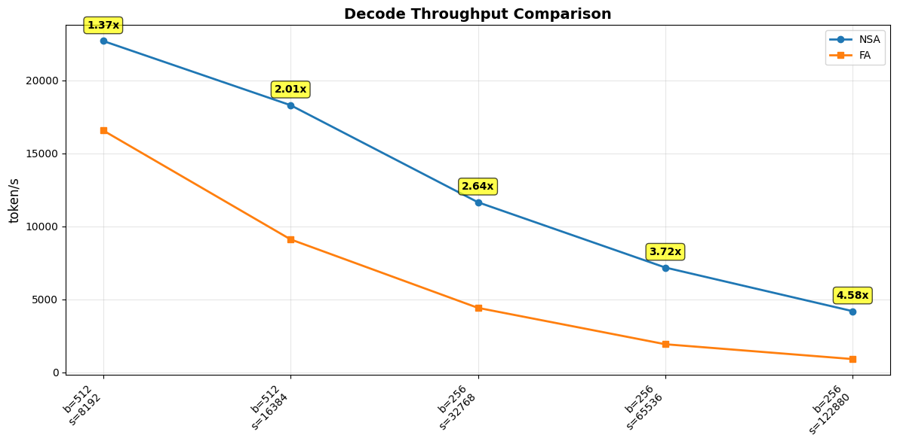
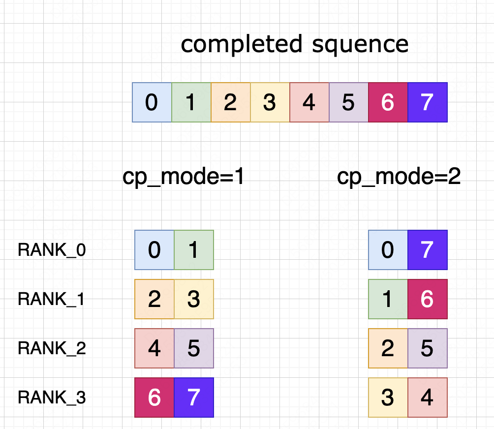

<div align="center">

# Scalable-Flash-Native-Sparse-Attention

</div>

This repository provides an efficient **Triton-based** implementation of the **Native-Sparse-Attention** algorithm optimized for **Hopper** architecture GPUs. It delivers superior performance compared to **Flash-Attention-2** for sequence lengths of 6K and above, and outperforms **Flash-Attention-3** for sequences of 11K and longer. The implementation also supports **Context Parallelism**, can easily scale sequence lengths up to **1 million**.

- [Scalable-Flash-Native-Sparse-Attention](#scalable-flash-native-sparse-attention)
  - [Installation](#installation)
  - [News](#news)
  - [Features](#features)
  - [Usage](#usage)
    - [**HF-Level-NSA**](#hf-level-nsa)
    - [**Megatron-Level-NSA**](#megatron-level-nsa)
  - [Benchmark](#benchmark)
    - [**Forward**](#forward)
    - [**Backward**](#backward)
    - [Gain Point](#gain-point)
    - [**CP Performance Degradation**](#cp-performance-degradation)
    - [**1M Context**](#1m-context)
    - [**Inference**](#inference)
      - [attention kernel](#attention-kernel)
      - [nano-vllm fixed seqlens](#nano-vllm-fixed-seqlens)
      - [nano-vllm random seqlens](#nano-vllm-random-seqlens)
  - [Context Parallelism](#context-parallelism)
    - [**Why All-Gather?**](#why-all-gather)
    - [**All-Gather Implementation**](#all-gather-implementation)
  - [Test Correctness](#test-correctness)
    - [**Non CP**](#non-cp)
    - [**CP**](#cp)
    - [**NoteBook**](#notebook)
  - [AutoTune](#autotune)
  - [Roadmap](#roadmap)
  - [Contact](#contact)
  - [Citation](#citation)
  - [Acknowledgments](#acknowledgments)

## Installation

The following requirements should be satisfied
- [PyTorch](https://pytorch.org/)
- [Triton](https://github.com/openai/triton) >=3.4

```sh
# install
git clone https://github.com/mdy666/Scalable-Flash-Native-Sparse-Attention.git
cd Scalable-Flash-Native-Sparse-Attention
pip install .
# pip uninstall flash-nsa
```

## News

- **$\texttt{[2025-10]}$:** 🎉 Support Ampere GPUS and triton==3.2.
- **$\texttt{[2025-09]}$:** 🎉 Share `Efficient-Scalable-Native-Sparse-Attention` for LLM researchers.

## Features

1. **Triton-based Custom Kernels**

    - All NSA operators (except matmul) are implemented in Triton

    - All attention-related kernels leverage TMA (Tensor Memory Accelerator) features for enhanced performance

2. **KV Compression**

    - Supports 4 efficient KV compression techniques: `mean`, `linear`, `swiglu`, and `sigmoid-mul`

    - Empirical findings from ablation studies:
      * `mean` compression works best for Key compression
      * `sigmoid-mul` or `mean` perform optimally for Value compression

3. **Dual Implementation Frameworks**

    - **Megatron-level NSA**: Production-ready implementation for large-scale training with extended features

    - **HuggingFace-level NSA**: Research-friendly version for easy experimentation and modifications

4. **Selective Recomputation (Megatron-level)**

    - 4 recomputation strategies supported:
      `compressed_kv`, `cmp_o`, `slc_o`, and `swa_o`

    - When fully enabled, achieves memory efficiency comparable to normal attention. Only final output (`combine_o`) is stored in memory

5. **Context Parallelism Implementation (Megatron-level)**

    - All-Gather based CP strategy

    - Two innovative data sharding patterns for optimal compute balancing

    - Computing head by head significantly reduces memory footprint

    - Unified kernel implementation handles both CP and non-CP cases

6. **Sequence Length Extend**

    - 1 GPU: 256K (ptr offset calculation limitation)

    - 8 GPU: 1M+ sequence length

7. **Fast Inference Speed**

    - Support nano-vllm
    
    - Kernels support prefix cache, chunk prefill, cuda graph.

    - In end to end test, 1.4-5x speed up compared with FA3
  
## Usage

### **HF-Level-NSA**

```py
import random
import torch
import triton
from flash_nsa import NSAConfig, HFNSACore

dtype = torch.bfloat16
device = "cuda"

config = NSAConfig()
qh = config.num_heads
kh = config.num_kv_heads
d = config.head_dim

# splits = [random.randint(4096, 8192) for _ in range(4)]
splits = [1024 * 64] * 1
t = sum(splits)

cu_seqlens = torch.tensor([0] + splits, device=device).cumsum(0).to(torch.int32)
q = torch.randn(t, qh, d, device=device, dtype=dtype).requires_grad_(True)
k = torch.randn(t, kh, d, device=device, dtype=dtype).requires_grad_(True)
v = torch.randn(t, kh, d, device=device, dtype=dtype).requires_grad_(True)
weight = torch.randn(t, qh, 3, device=device, dtype=dtype).requires_grad_(True)

nsa = HFNSACore(config).to(q)
o = nsa(q, k, v, weight, cu_seqlens)
do = torch.randn_like(o)
o.backward(do, retain_graph=True)
print(triton.testing.do_bench(lambda: nsa(q, k, v, weight, cu_seqlens), warmup=100, rep=500))
print(triton.testing.do_bench(lambda: o.backward(do, retain_graph=True), grad_to_none=[q, k, v, weight], warmup=100, rep=500))
```

### **Megatron-Level-NSA**

```py
import random
import torch
import triton
from flash_nsa import NSAConfig, NSACore

dtype = torch.bfloat16
device = "cuda"

config = NSAConfig(
  recompute_cmp_kv=False, 
  recompute_cmp_o=False, 
  recompute_swa_o=False, 
  recompute_slc_o=False
)
qh = config.num_heads
kh = config.num_kv_heads
d = config.head_dim

# splits = [random.randint(4096, 8192) for _ in range(4)]
splits = [1024 * 64] * 1
t = sum(splits)

cu_seqlens = torch.tensor([0] + splits, device=device).cumsum(0).to(torch.int32)
q = torch.randn(t, qh, d, device=device, dtype=dtype).requires_grad_(True)
k = torch.randn(t, kh, d, device=device, dtype=dtype).requires_grad_(True)
v = torch.randn(t, kh, d, device=device, dtype=dtype).requires_grad_(True)
weight = torch.randn(t, qh, 3, device=device, dtype=dtype).requires_grad_(True)

nsa = NSACore(config, process_group=None, pp_size=1).to(q)
o = nsa(q, k, v, weight, cu_seqlens)
do = torch.randn_like(o)
o.backward(do, retain_graph=True)
print(triton.testing.do_bench(lambda: nsa(q, k, v, weight, cu_seqlens), warmup=100, rep=500))
print(triton.testing.do_bench(lambda: o.backward(do, retain_graph=True), grad_to_none=[q, k, v, weight], warmup=100, rep=500))
```

## Benchmark

We compare NSA with the latest versions of FA2 and FA3 (excluding the `qkv_proj` transformation process, with input being **qkv** and output being **o**). 

**Environment Settings:**
- `GPU`: H800
- `cuda`: 12.6
- `torch`: 2.8
- `triton`: 3.4
- `FA2`: 2.8.3
- `FA3`: 3.0.0b1


**Configuration Settings:**
- `num_heads`: 64
- `num_kv_heads`: 4
- `head_dim`: 128
- `kernel_size`: 32
- `stride`: 16
- `block_size`: 64
- `top_n`: 16
- `sequence_length`: 4K - 128K

### **Forward**



```sh
num_head=64, num_kv_head=4, head_dim=128, forward:
     seqlen         NSA         FA2         FA3
0    4096.0    1.370335    0.826244    0.468241
1    8192.0    2.629667    3.054532    1.693475
2   16384.0    5.659996   11.676872    6.690040
3   32768.0   13.236773   46.911713   26.711466
4   65536.0   34.162239  182.879227  105.494339
5  131072.0  101.123390  774.342285  431.018188
```

### **Backward**



```sh
num_head=64, num_kv_head=4, head_dim=128, backward:
     seqlen         NSA          FA2          FA3
0    4096.0    2.771820     2.503270     1.379237
1    8192.0    5.570735     9.009357     5.013627
2   16384.0   12.322220    33.972258    18.735635
3   32768.0   28.959669   131.634491    74.799133
4   65536.0   73.688576   523.686218   292.343994
5  131072.0  213.904358  2068.491943  1169.143921
```

### Gain Point

* Compare the fwd + bwd time
* NSA vs FA2, gain point is 6k.
* NSA vs FA3, gain point is 11k.



```sh
num_head=64, num_kv_head=4, head_dim=128, forward + backward:
     seqlen        NSA        FA2        FA3
0    4096.0   4.185116   3.328314   1.850062
1    5120.0   5.153502   5.012054   2.781427
2    6144.0   6.140277   6.995335   4.015884
3    7168.0   7.226517   9.322736   5.342618
4    8192.0   8.260646  11.991636   6.794184
5    9216.0   9.386453  14.932440   8.474086
6   10240.0  10.541426  18.293620  10.391339
7   11264.0  11.686464  21.848267  12.324539
8   12288.0  12.848530  25.944415  14.807383
9   13312.0  14.098859  30.787786  17.191744
10  14336.0  15.365877  35.027727  22.138432
11  15360.0  16.646502  40.069649  22.645360
12  16384.0  18.304672  45.670176  25.678582
```

### **CP Performance Degradation**

When CP is enabled, observe the current performance compared to the non-CP scenario.

8GPU, num_heads=64, num_kv_heads=4, head_dim=128





### **1M Context**

8GPU, num_heads=64, num_kv_heads=4, head_dim=128

```sh
# bash examples/cp_run.sh --func 1M
forward  : 575.5625
backward : 1509.2296875 
```

### **Inference**

#### attention kernel



```sh
num_head=64, num_kv_head=4, head_dim=128, kv memory=4G, decoding:
     seqlen       NSA  GRAPH-NSA       FA3
0    4096.0  0.700775   0.689377  1.034566
1    8192.0  0.433544   0.420754  1.021608
2   16384.0  0.360706   0.279387  1.003379
3   32768.0  0.348726   0.205926  1.024930
4   65536.0  0.349135   0.172448  1.001430
5  131072.0  0.355115   0.159892  0.997100
```

#### nano-vllm fixed seqlens

qh=64, kh=4, head_dim=128, num_layers=12.

- It's not the best performance for nsa, because they all use the same fixed_tensor_shape for 128k. 8K context can speed up 1.5x





#### nano-vllm random seqlens

num_seqs=1024, random input between 4096-7680, random output between 512-2048 and input + output <= 8192

|  Attention Type        | NSA           | FA3            |
|------------------------|-----------------------|-----------------------|
| num_seqs               | 1024                  | 1024                  |
| total_time             | 113.10s               | 122.65s                |
| total_prefill_tokens   | 6,050,308             | 6,050,308             |
| total_decode_tokens    | 1,209,439             | 1,209,439            |
| prefill_throughput     | 9.0883.27 tok/s       | 10,4285.43 tok/s      |
| decode_throughput      | 26,049.70 tok/s       | 18,742.70 tok/s       |

## Context Parallelism

The growing demand for **long-context processing** in LLMs makes attention sequence scalability a critical design consideration. We analyze three mainstream CP approaches:

| CP Strategy       | Compatibility with NSA | Key Limitation |
|-------------------|-----------------------|----------------|
| DeepSpeed-Ulysses | ⚠️ Partial             | KV head constraints |
| Ring Attention    | ❌ Not suitable        | Position sensitivity |
| **All-Gather**    | ✅ **Optimal choice**  | **Best scalability** |

### **Why All-Gather?**

1. **DeepSpeed-Ulysses Limitations**

   - Maximum CP size constrained by `num_kv_heads`

   - NSA typically uses minimal KV heads (2-4) for optimal performance

   - KV repetition would:
     * Introduce extra communication overhead (`compute topk`)
     * Degrade `slc_attn` efficiency

   - Only available not too long sequences (≤32K)

2. **Ring Attention Incompatibility**

   - Fundamentally conflicts with NSA's:
     * Compress/select modules
     * Absolute position requirements

### **All-Gather Implementation**

**Key Innovations:**

- **Memory Optimization**:
  * Computating head by head, reduces kv all-gather memory footprint 

- **Load Balancing**:
  * The influence of unbalance is small for `NSA`. `slc_attn` and `swa_attn` are linear complexity, only `cmp_attn` and `top_k` are square complexity.
  * For more balance, we provde two data sharding modes (`cp_mode=1` and `cp_mode=2`)
  * Dynamic choose `cp_mode` according to `cu_seqlens`
  * How to process batch please watch the [get_batch.py](./flash_nsa/get_batch.py)



## Test Correctness

### **Non CP**

More details please watch the [test.py](./test.py) and [run.sh](./examples/run.sh)

```sh
bash examples/run.sh
```

### **CP**

More details please watch the [test_cp.py](./test_cp.py) and [cp_run.sh](./examples/cp_run.sh)

```sh
bash examples/cp_run.sh
```

### **NoteBook**

For more details about `NSA` and kernel introduction, please look [notebook](./notebook.ipynb)

## AutoTune

I have fixed all the kernel kwargs like BLOCK_SIZE, num_warps or num_stages. Because there are some kernel need atomic_add, so we don't use autotune in training. 

I tuned the kernel kwargs for qk_head_dim=128 or 192 and v_head_dim=128, these two setting is very common.

If you have the same environment like me, the nsa performance in your device should close the benchmark. If you find the performance is very worse, please tune the kernel by youself.

How to tune the kernel (use _attn_probs_kernel as a example):

**step1**: Comment out kwargs at the function call location and enable the autotune of the function.

```py
_attn_probs_kernel[grid](
    q, 
    k, 
    lse, 
    attn_probs,
    x_cu_seqlens,
    y_cu_seqlens,
    CP,
    cp_cu_seqlens,
    cp_batch_idx,
    cp_offset,
    *q.stride(),
    *k.stride(),
    *lse.stride(),
    *attn_probs.stride(),
    sm_scale, 
    kernel_size, 
    stride,
    pad_y_maxlen,
    KH, 
    G,
    D1, 
    D2,
    # **kwargs
)

@triton.autotune([triton.Config({'BLOCK_M': bsm, 'BLOCK_N': bsn}, num_stages=ns, num_warps=nw)
                 for bsm in [64, 128]
                 for bsn in [64, 128]
                 for ns in [1, 2, 3, 4]
                 for nw in [4, 8]
                 ], key=['D1', "D2"])
@triton.jit
def _attn_probs_kernel
```
**step2**: Run this kernel (in notebook or xx), you will get the bset config. Please set `os.environ['TRITON_PRINT_AUTOTUNING'] = '1'`

```sh
Autotuning kernel _attn_probs_kernel with config BLOCK_M: 128, BLOCK_N: 128, num_warps: 8, num_ctas: 1, num_stages: 3, maxnreg: None
Autotuning kernel _attn_probs_kernel with config BLOCK_M: 128, BLOCK_N: 128, num_warps: 4, num_ctas: 1, num_stages: 4, maxnreg: None
Autotuning kernel _attn_probs_kernel with config BLOCK_M: 128, BLOCK_N: 128, num_warps: 8, num_ctas: 1, num_stages: 4, maxnreg: None
Triton autotuning for function _attn_probs_kernel,
with key as (128, 0, 'torch.bfloat16', 'torch.bfloat16', 'torch.float32', 'torch.float16', 'torch.int32', 'torch.int32'),
finished after 14.13s,
best config selected: BLOCK_M: 64, BLOCK_N: 64, num_warps: 4, num_ctas: 1, num_stages: 1, maxnreg: None;
```

**step3**: Use the best config for kwargs, uncomment kwargs at the function call location and disable the autotune of the function.

## Roadmap

If you can help me slove these issues, please contact me.

- [] Better autotune methods
- [] One gpu run 512k
- [] In inference, make topk more compatible with CUDA Graph

## Contact

* If you meet a trouble, please feel free to open a issue or contact maduyue1031@gmail.com
* Everyone is welcome to submit pull requests.
* My RedNote(小红书) id is `5628592335`


## Citation

```bib
@inproceedings{Yuan2025NativeSA,
    title   = {Native Sparse Attention: Hardware-Aligned and Natively Trainable Sparse Attention},
    author  = {Jingyang Yuan and Huazuo Gao and Damai Dai and Junyu Luo and Liang Zhao and Zhengyan Zhang and Zhenda Xie and Y. X. Wei and Lean Wang and Zhiping Xiao and Yuqing Wang and Chong Ruan and Ming Zhang and Wenfeng Liang and Wangding Zeng},
    year    = {2025},
    url     = {https://api.semanticscholar.org/CorpusID:276408911}
}
```

## Acknowledgments

This repo is developed on: [Qwen-Native-Sparse-Attention](https://github.com/mdy666/Qwen-Native-Sparse-Attention)


